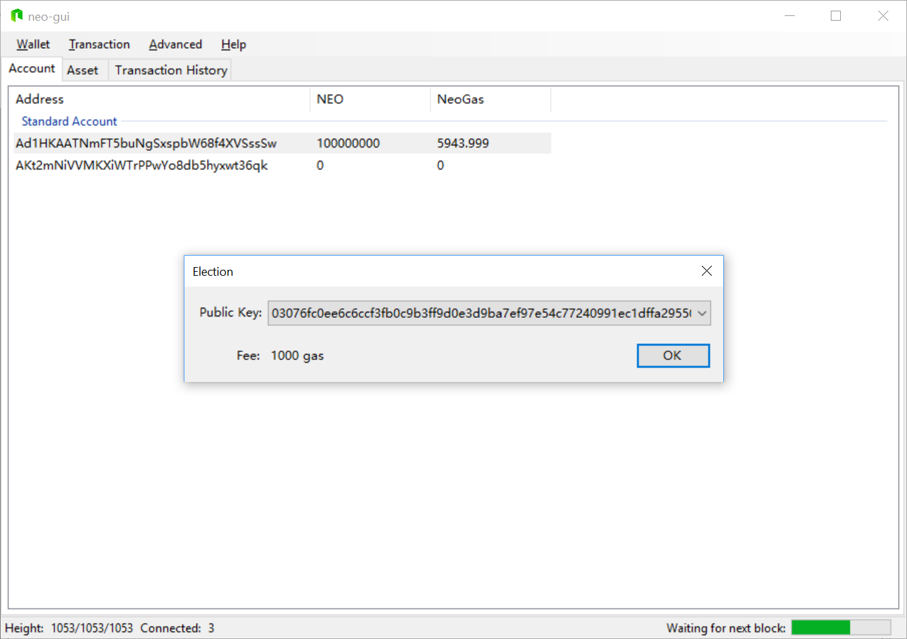
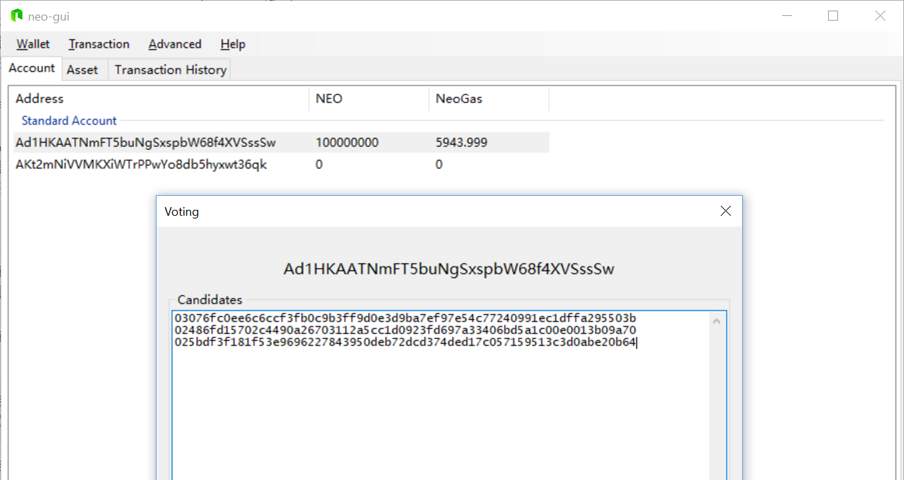

# How To Become A Consensus Node
*[中文版](如何成为共识节点.md)*

## Current Consensus Nodes

The NEO Mainnet currently has 7 consensus nodes. 6 of them are being maintained by NEO Foundation, while 1 is maintained by CityOfZion. NEO plans to expand the number of consensus nodes maintained by the community. This guide will cover the requirements and process of becoming a consensus node. 

## 1. Requirements

### 1.1 Hardware Requirements

AWS EC2 m5d.xlarge, 4 core processor, 16 GB RAM, 10GB Bandwidth, 150 SSD  *(equivalent or above)*

### 1.2 Other Criteria

Anyone who applies for becoming a consensus node candidate is advised to provide some, or all of the information listed below. 

- Applicant/Organization Information

  - A public website and social media account
  - Organization name and location
  - A list of at least 2/3 of the team with pictures and relevant background qualifications on each
  - Telegram account or other ways of contact

- Server type and specifications

- The applicant's solutions to

  - Safety & security of the node
  - Maintenance
  - Long term stability
  - Failure tolerance/recovery backup
  - Maintenance personnel
  - Budget

- Plans for potential hardware scaling/upgrading

- NEO Community participation/contribution *(if applicable)*

- Test-net consensus node name *(if applicable)*

> *An application will be evaluated on the criteria above.*

## 2. Application

### 2.1 E-mail Application

An application containing information listed in [1.2](#12-other-criteria) can be emailed to: 

linpengtao@neo.org

### 2.2 Website Application

> *The 'Apply to be Consensus Node Candidate' feature will be available on the [neo.org](neo.org) website soon.*

### 2.3 Application Feedback/Results

The applicant or organization will be informed of the result by email. 

If the application is not successful, it can always be re-submitted with improved specifications and solutions. 

## 3. Test-net Consensus Node

If the application is successful, the applicant will start by running a consensus node on the Test-net. 

If problem arises with the consensus node during this period, active communication and troubleshooting is expected. NGD will provide technical support if these situations arise. 

After 6 months of running the test-net, the applicant will be qualified to become a candidate for a consensus node on the main-net. 

> *If the applicant can prove that they have maintained NEO main-net nodes reliably for over 6 months, (eg. If the applicant/organization has maintained an exchange that supports NEO) this process can be skipped.*

## 4. Becoming a Candidate

> *The GUI operations of becoming a candidate and voting (Sections 4 and 5) are the same on both Test-net and Main-net. The difference is determined by which chain the GUI is synced to. To switch between test-net and main-net on GUI, see [this document](http://docs.neo.org/en-us/network/testnet.html).* 

Once the application is successful, you can use the NEO GUI to register as a candidate. Candidates will be voted by NEO token holders to determine how many nodes and which nodes will become the consensus node. 

1. In NEO-GUI, open a wallet. 

2. Select `Advanced` -> `Election` 

3. Select the public key of the account in the list and click `OK`. Note that 1000 GAS will be charged at this step.

   

4. If the message of a transaction ID is displayed, then the transaction is constructed successfully. You can check if the candidate has been successfully registered by accessing the API. (See [Section 6](#6-checking-candidates-and-votes-using-api))

## 5.Voting for Candidates

### 5.0 The Voting Mechanism\*

*\*: NEO3.0 will make adjustments to the voting mechanism. This section will be updated accordingly when 3.0 launches.*

Each NEO node can vote for the candidates. The number of NEO in the current voting account will be automatically calculated as the number of the candidate's votes. When voting for multiple candidates, each candidate gets the votes equal to the NEO number of the current voting account. For example, if there are 100 NEO in the current account and three candidates are voted for from this account, each candidate receives 100 votes. If NEO in the account is spent after the vote, the candidates' votes will simultaneously be decreased to the current NEO balance.

After voting, the NEO network calculates in real time based on the number of candidates cast by each account and determines the consensus nodes. The calculation method is:

1. Sort the number of the candidates each account voted for by size, e.g. C1, C2, ..., Cn
2. Remove the first 25% and the last 25% of the data in the array
3. Calculate the weighted average of the remaining 50% data, which is then determined as the current NEO consensus node number N
4. The top N candidates with the highest number of votes become consensus nodes

### 5.1 To Vote

1. In NEO-GUI, open the wallet account to vote. 

2. Right-click on the account -> `Vote`.

3. In the Candidates field, enter the public key of the candidate to vote. You can enter multiple public keys separated by Line feeds. Note that each line cannot contain spaces, as shown in the following figure:

   
   *Example: giving three candidates each 100000000 votes.*

4. If the message of a transaction ID is displayed, then you have voted successfully. Youc an check the number of votes for each candidate by accessing the API. (See [Section 6](#6-checking-candidates-and-votes-using-api))

## 6. Checking Candidates and Votes using API

To check the number of votes on each candidate that has registered, you can use Postman or any other RPC program to access the API. (For instructions on how to, see [this document](Using RPC to Call NEO API.md))

As shown below, send a `getvalidators` request to the API. 

The node returns a json file containing public keys of candidates and the votes each one received. 

In the picture, the candidate with the public key `3076fc0ee6c6ccf3fb0c9b3ff9d0e3d9ba7ef97e54c77240991ec1dffa295503b` was given 100000000 votes. 
