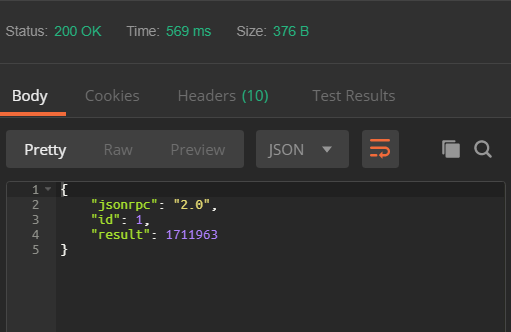

# Accessing NEO API with RPC
*[中文版](如何成为共识节点Part2%20-%20进行投票.md)*

When running a NEO node with NEO CLI, it provides an API interface for obtaining blockchain data from the node, making it easy to develop blockchain applications. The interface is provided via [JSON-RPC](http://wiki.geekdream.com/Specification/json-rpc_2.0.html), and the underlying protocol uses HTTP/HTTPS for communication. This guide will go through how to send an API call using Postman. 

#### Requirements

- [NEO CLI](https://github.com/neo-project/neo-cli/releases)
- [Postman](https://www.getpostman.com/apps) (Or any other RPC program)
- Windows / Linux system

#### Procedures

0. If you are accessing RPC using HTTP, skip this step. If you are using HTTPS, open config.json in the NEO-CLI directory. Change the Values for `"RPC"` into: 

      ```json
      "RPC": {
        "Port": 10331,
        "SslCert": "YourSslCertFile.xxx",
        "SslCertPassword": "YourPassword"
      }
      ```


   Reference the table below for the value of`"Port"` 

|                | Main Net | Test Net |
| -------------- | -------- | -------- |
| JSON-RPC HTTPS | 10331    | 20331    |
| JSON-RPC HTTP  | 10332    | 20332    |

   *Table 1*


1. In command lines, navigate to the NEO-CLI directory.

2. Launch NEO CLI with RPC using the following command

   ```bash
   dotnet neo-cli.dll --rpc
   ```
   After ensuring that the node is running and *synced to the latest block*, proceed to Postman

3. Create a new request, set the request type to `POST`

   

   Enter the request URL

   ```
   http://localhost:{port}
   ```

   {port} is the value of your RPC port in config.json. See *Table1*. 

   Enter request body as a json file: 

   ```
   {
     "jsonrpc": "2.0",
     "method": "getblockcount",
     "params":[],
     "id": 1
   }
   ```

   As shown in the picture, the example calls a `getblockcount` method. 

   

   *Reference [this page](http://docs.neo.org/en-us/node/cli/apigen.html) for the Json format of API requests.*

4. Send the request, if you get a return like this, the request is successful. 

   
