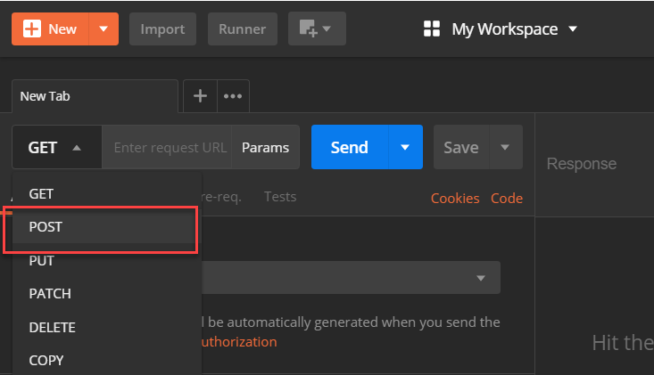
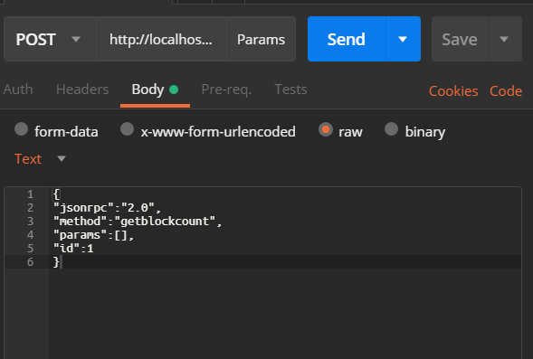

# 使用RPC调用NEO API
*[English Ver. of this Guide](Using%20RPC%20to%20Call%20NEO%20API.md)*

每个 NEO 节点 Neo-CLI 都可选的提供了一套 API 接口，用于从节点获取区块链数据，使得开发区块链应用变得十分方便。接口通过 [JSON-RPC](http://wiki.geekdream.com/Specification/json-rpc_2.0.html) 的方式提供，底层使用 HTTP/HTTPS 协议进行通讯。以下是使用Postman调用API的例子。

#### 所需环境

- [NEO CLI](https://github.com/neo-project/neo-cli/releases)
- [Postman](https://www.getpostman.com/apps) (或者其他RPC软件)
- Windows / Linux 系统

#### 调用过程

0. 如果使用HTTP调用，跳过这步。如果要使用HTTPS，打开NEO CLI所在目录的`config.json`，如下修改`"RPC"`对应的几个值：

      ```json
      "RPC": {
        "Port": 10331,
        "SslCert": "YourSslCertFile.xxx",
        "SslCertPassword": "YourPassword"
      }
      ```


   `"Port"` 对应的值参考这个表格

|                | 主网(Main Net) | 测试网(Test Net) |
| -------------- | ------------ | ------------- |
| JSON-RPC HTTPS | 10331        | 20331         |
| JSON-RPC HTTP  | 10332        | 20332         |

   *表1*

   `YourSslCertFile.xxx`: 你的SSL证书

   `YourPassword`: SSL证书密码

1. 在命令行中进入NEO-CLI的所在目录

2. 运行NEO-CLI节点，打开RPC服务。运行如下命令：

   ```bash
   dotnet neo-cli.dll --rpc
   ```
   确认节点运行且同步到最新区块后，打开postman 

   *注意: 当使用离线同步包同步区块时，节点可能无法响应 API 请求。而在未同步到最新区块时发送请求，返回的结果可能不是最新的。*

3. 创建新RPC请求，把请求类型改为POST

   

   输入请求URL

   ```
   http://localhost:{port}
   ```

   {port} 由config.json中的`"RPC"` `"Port"`项决定

   编辑请求的`Body`项：

   ```
   {
     "jsonrpc": "2.0",
     "method": "getblockcount",
     "params":[],
     "id": 1
   }
   ```

   此例子发送的是`getblockcount`请求

   

   *关于API请求的json文件发送格式，[见文档的命令列表](http://docs.neo.org/zh-cn/node/cli/2.7.6/api.html)。*

4. 如果发送请求后收到此响应，则意味着请求发送成功

   
